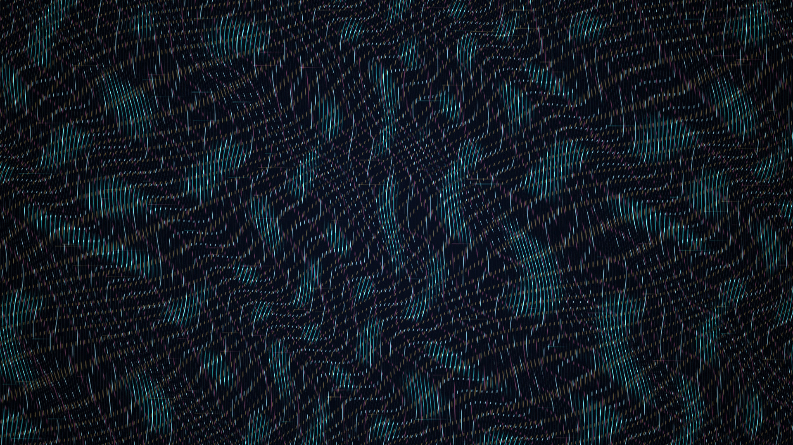

# lenticular_night

## Metadata
- **Date**: 2026-05-03
- **Theme**: optical surface, hidden images, nocturnal perception, angle-shifted memory
- **Technique**: Phase-shifted lenticular stripe masks, warped layer fields, crisp separator bands, sparse glint synthesis

## Concept
A dark optical field flickers with cyan, muted rose, and pale-gold fragments revealed through precise slanted seams; multiple hidden layers misregister into a dense full-canvas lenticular surface.

## Technical Details
- **Renderer**: P2D
- **Simulation**: Phase-shifted lenticular stripe masks
- **Visuals**: warped layer fields, crisp separator bands, sparse glint synthesis
