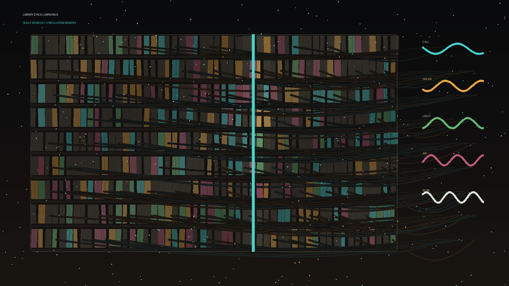

# library_stack_luminance

## Metadata
- **Date**: 2026-05-26
- **Theme**: Generative Art
- **Technique**: This 10-second 60fps animation renders dense shelf rows, shifting call-number blocks, a moving scanner beam, checkout arcs, dust, and environmental traces. The palette combines graphite, paper cream, cyan, amber, rose, and green.
- **Logic Lab Reference**: 

## Concept
No concept description provided.

## Technical Details
- **Renderer**: Unknown
- **Simulation**: Unknown
- **Visuals**: Unknown
- **Animation**: Contains animation details
