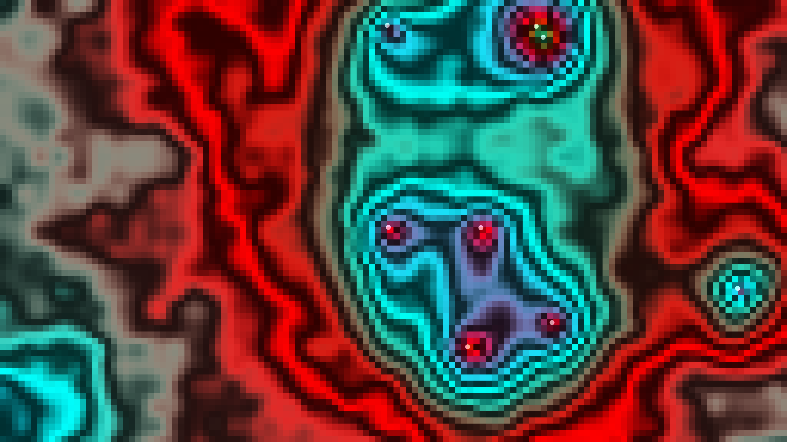

# liquid_crystal

A generative visualization of the mesmerizing, shimmering patterns of a liquid crystal thin film observed under a cross-polarized microscope.

## Concept

This artwork explores the hidden beauty of soft matter physics. It simulates the behavior of a liquid crystal thin film where molecular orientation (the "director field") is influenced by local noise and topological defects. When viewed through cross-polarizers, the varying orientation of the molecules creates characteristic "Schlieren" textures—vibrant plumes of color separated by dark lines where the molecules align with either the polarizer or analyzer.

## Technique

- **Director Field Simulation**: A multi-scale noise field defines the local molecular orientation at each point in the film.
- **Topological Defects**: Dynamic singular points (defects) move through the field, exerting a long-range influence on the molecular orientation and creating swirling patterns.
- **Schlieren Texture Equation**: The visual intensity is calculated using the physical equation for light transmission through a birefringent medium between cross-polarizers: $I = I_0 \sin^2(2\theta)$, where $\theta$ is the angle between the director and the polarizer.
- **Iridescent Palette**: A time-varying, noise-driven iridescent mapping simulates the colorful interference patterns seen in thin films.
- **Grid-Based Rendering**: The simulation is performed on a downsampled grid to achieve a "digital microscopic" aesthetic while maintaining high performance for complex calculations.

## Data

- **Date**: 2026-05-02
- **Theme**: Physics, Microscopic, Iridescence, Soft Matter
- **Technique**: Schlieren texture simulation, Director field noise, Iridescent mapping, Polarized light physics
- **Format**: 10s Animation @ 60fps (MP4)
