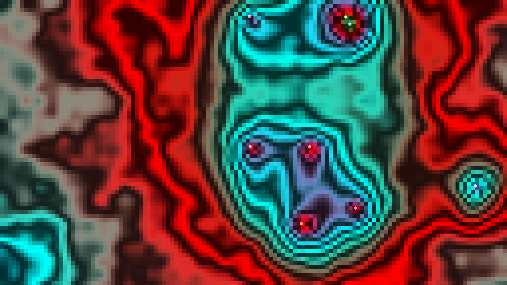

# liquid_crystal

## Metadata
- **Date**: 2026-05-02
- **Theme**: physics, microscopic, iridescence, soft matter.
- **Technique**: Schlieren texture simulation, director field noise, iridescent mapping, polarized light physics.
- **Logic Lab Reference**: None

## Concept
Shimmering iridescent patterns of a liquid crystal thin film under a cross-polarized microscope, featuring dynamic Schlieren textures and topological defects.

## Technical Details
- **Renderer**: P2D
- **Simulation**: Schlieren texture simulation, director field noise, iridescent mapping, polarized light physics.
- **Visuals**: dark-field contrast.
- **Animation**: 10 seconds at 60fps
