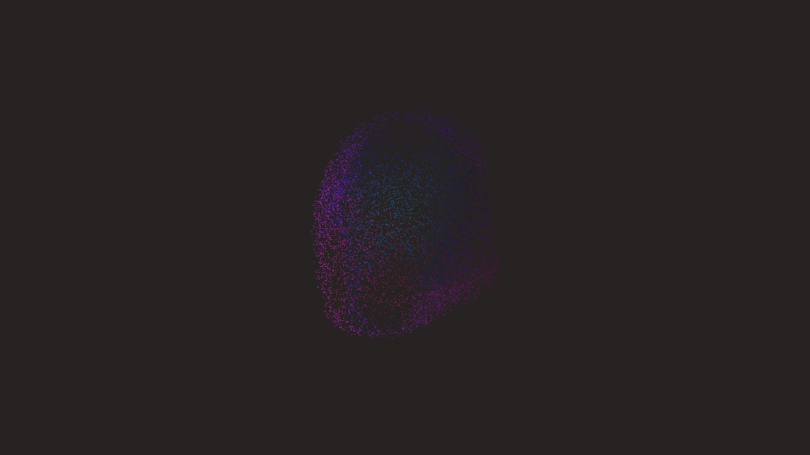

# liquid_glass_metaball_flow_3d

## Metadata
- **Date**: 2026-06-05
- **Theme**: Generative Art
- **Technique**: A highly optimized 3D marching cubes approximation running on a NumPy grid to evaluate isosurfaces from multiple moving spherical field sources. The generated point cloud is rendered with additive blending and smooth spatial coloring to give the illusion of organic, flowing liquid.  
- **Logic Lab Reference**: 

## Concept
No concept description provided.

## Technical Details
- **Renderer**: Unknown
- **Simulation**: Unknown
- **Visuals**: Unknown
- **Animation**: Contains animation details
