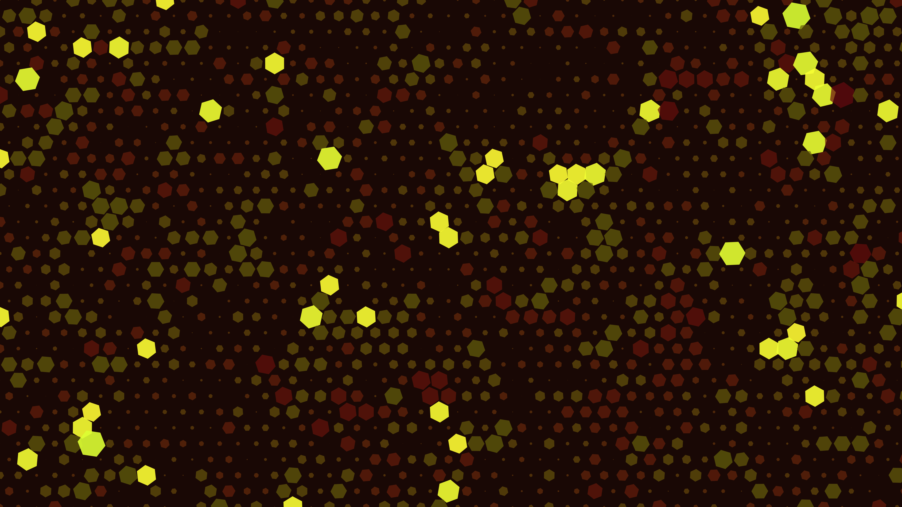

# liquid_gold_honeycomb_domain_warp

## Metadata
- **Date**: 2026-05-31
- **Theme**: Generative Art
- **Technique**: A massive 2D hexagonal grid. Each hexagon's internal radius and rotation are driven by two passes of domain-warped OpenSimplex noise over time, creating a liquid-metal effect that breaks the rigid geometry.
- **Logic Lab Reference**: 

## Concept
No concept description provided.

## Technical Details
- **Renderer**: Unknown
- **Simulation**: Unknown
- **Visuals**: Unknown
- **Animation**: Contains animation details
