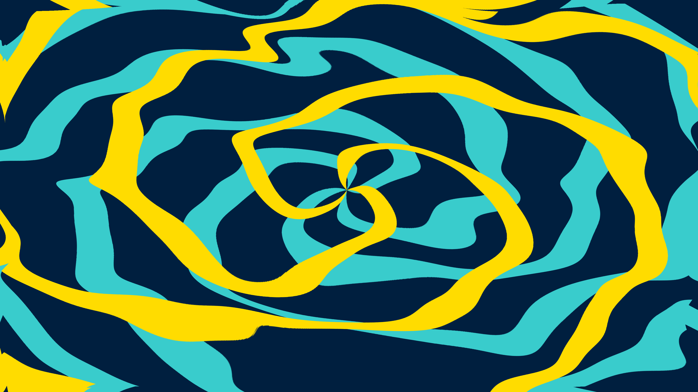

# liquid_marble_domain_warp

An infinitely recursive, liquid marble domain warp that resembles swirling liquid gold and deep ocean currents.

## Details

- **Date**: 2026-05-31
- **Theme**: An infinitely recursive, liquid marble domain warp that resembles swirling liquid gold and deep ocean currents.
- **Technique**: Iterative image displacement (Domain Warping) using OpenCV `cv2.remap` for extremely fast, hardware-optimized CPU pixel sampling. Generates perfect fluid dynamics without the performance cost of pure Python noise generation.
- **Palette**: Deep ocean blue, striking cyan, and brilliant liquid gold.

## Previews



## Usage

```bash
uv run python main.py
```
