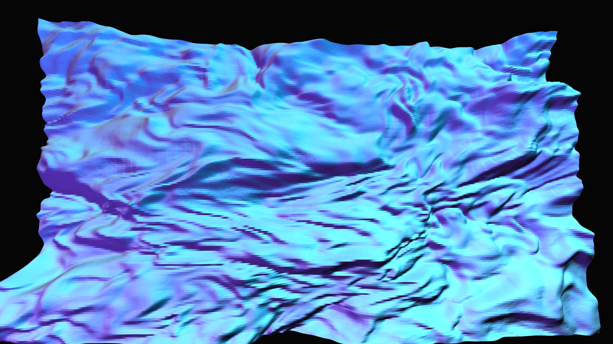

# liquid_topology

## Metadata
- **Date**: 2026-05-04
- **Theme**: Fluid intelligence, liquid data, topological deformation, metallic reflection
- **Technique**: Multi-octave domain-warped noise terrain, P3D high-density vertex mesh, multi-source specular highlight simulation, viscous motion advection
- **Logic Lab Reference**: `physics/noise_terrain/noise_terrain.py` — used for noise-driven 3D surface generation

## Concept
A mesmerizing, shimmering field of liquid silver that ripples and flows across the entire canvas; light catches the viscous peaks in electric cyan and deep violet, creating a sense of immense depth and complexity as the topological surface deforms.

## Technical Details
- **Renderer**: P3D
- **Simulation**: Multi-octave domain-warped noise terrain
- **Visuals**: P3D high-density vertex mesh, multi-source specular highlight simulation, viscous motion advection
- **Animation**: 10s @ 60fps (typical)
