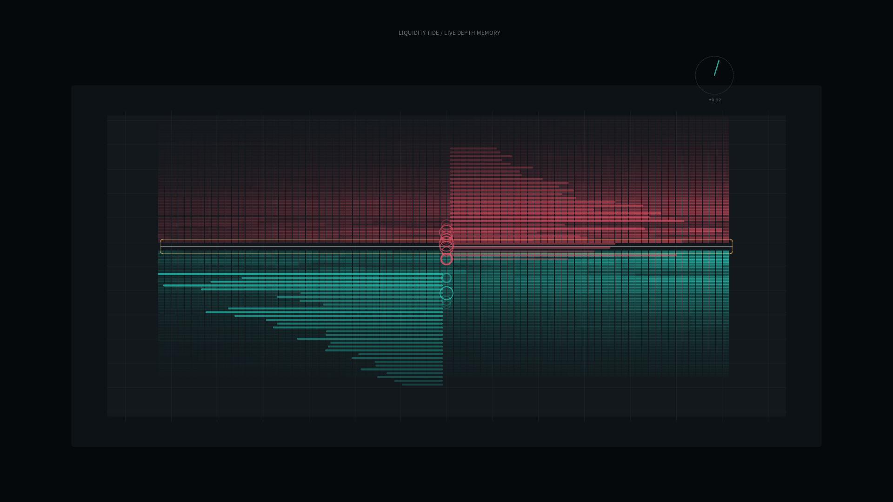

# liquidity_tide

## Metadata
- **Date**: 2026-05-19
- **Theme**: A market order book breathing like a tide as invisible pressure moves around the midprice.
- **Technique**: Stochastic limit-order-book simulation with bid/ask depth arrays, order arrivals, cancellations, trade pulses, spread pressure, scrolling depth-memory heatmap, and imbalance meter.
- **Logic Lab Reference**: None

## Concept
`liquidity_tide` turns market microstructure into a nocturnal instrument panel. Bid and ask liquidity accumulates and vanishes around the midprice, trade impacts ripple outward, and the scrolling heatmap leaves a memory of pressure moving through the book.

## Technical Details
- **Renderer**: P2D
- **Simulation**: Procedural limit order book with stochastic liquidity replenishment, depletion, trade events, and imbalance-driven midprice drift
- **Visuals**: Graphite terminal panel, cyan bid depth, rose ask depth, amber spread pressure, silver midprice reference
- **Animation**: 10 seconds at 60fps, generating `output.mp4` and `liquidity_tide_p1.png`
