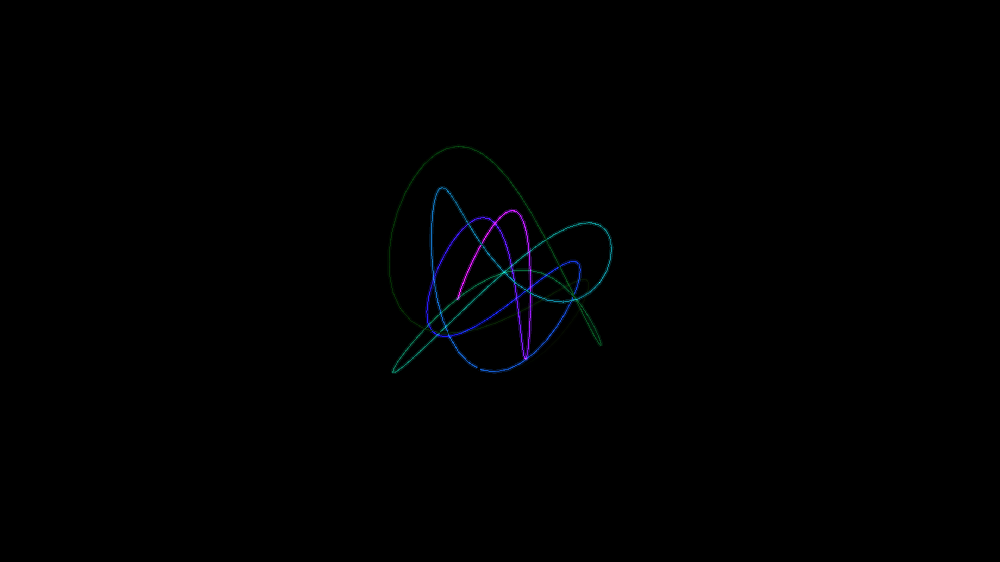

# lissajous_knot_tracer

## Metadata
- **Date**: 2026-05-27
- **Theme**: - **Date**: 2026-05-27 - **Theme**: A complex, infinitely weaving 3D ribbon tracing mathematical Lis
- **Technique**: Unknown
- **Logic Lab Reference**: 

## Concept
- **Date**: 2026-05-27
- **Theme**: A complex, infinitely weaving 3D ribbon tracing mathematical Lissajous knots in space.
- **Technique**: A parametric equation combining multiple sine and cosine waves to define a 3D path. A trail of previous points is stored and drawn as a continuous glowing line segment series.
- **Description**: An animated 3D lissajous knot tracer.

## Technical Details
- **Renderer**: Unknown
- **Simulation**: Unknown
- **Visuals**: Unknown
- **Animation**: Unknown
