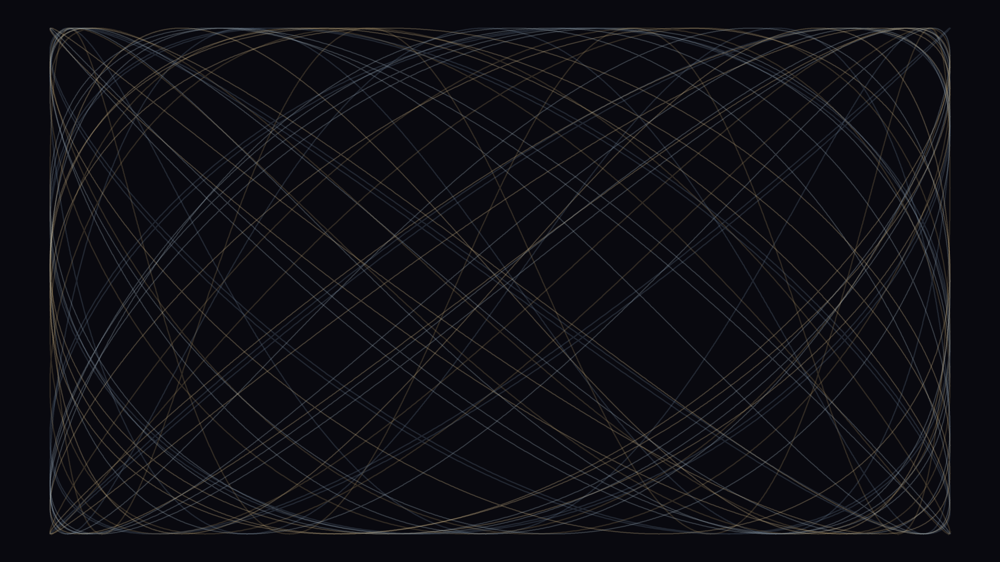

# Lissajous Web

Twenty-four Lissajous figures — parametric curves x = sin(at + δ), y = sin(bt) — are overlaid using frequency ratios spanning 1:2 to 7:11. Each figure is drawn in a distinct hue with a random phase offset. Where curves share boundary extremes (sin = ±1) they accumulate, forming a glowing rectangular frame; in the interior, crossing angles encode the mathematical relationship between each pair of frequencies.
