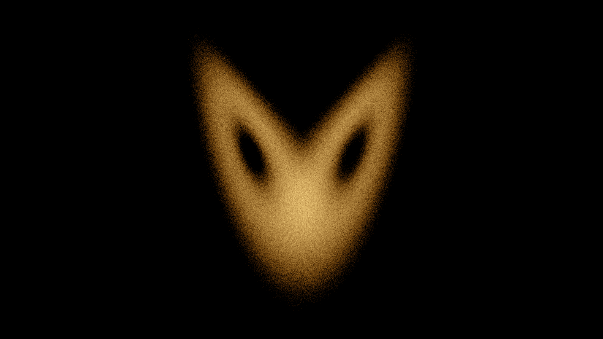

# lorenz_attractor

## Metadata
- **Date**: 2026-04-26
- **Theme**: chaos theory, physics, meteorology, strange attractor.
- **Technique**: RK4 ODE integration, 800 parallel trajectories, density accumulation, log tone mapping.
- **Logic Lab Reference**: None

## Concept
20 million trajectory points traced through the Lorenz convection system projected onto the (x,z) plane; density accumulation reveals the twin-lobed butterfly with dark hollow cores and warm amber density gradient.

## Technical Details
- **Renderer**: P2D
- **Simulation**: RK4 ODE integration, 800 parallel trajectories, density accumulation, log tone mapping.
- **Visuals**: bloom-like highlights, dark-field contrast.
- **Animation**: Still image
