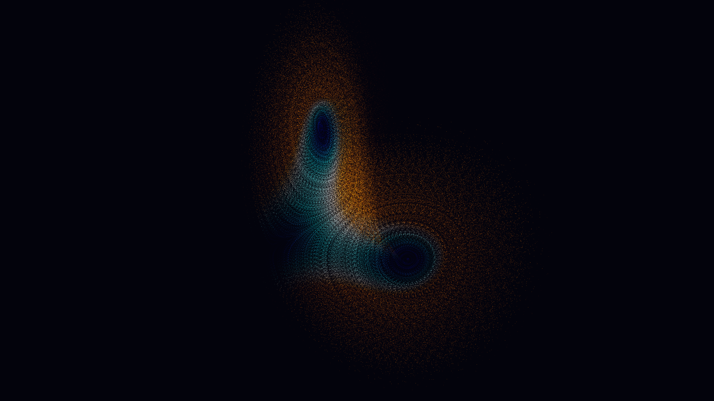

# lorenz_butterfly_chaos_attractor_3d

## Metadata
- **Date**: 2026-06-08
- **Theme**: The Lorenz system (σ=10, ρ=28, β=8/3) is the canonical example of deterministic chaos: three simple 
- **Technique**: - **Physics**: Vectorized numpy Euler integration of the Lorenz ODE, 3 sub-steps per frame at dt=0.005 - **Rendering**: CPU pixel-buffer with additive blending; each frame decays by 97% toward background (trail persistence) - **Coloring**: Velocity magnitude → thermal gradient: navy (slow) → cobalt → cyan → hot-white → amber-orange (fast) - **Camera**: Slow Y-axis rotation + subtle X wobble, simulated via 3D rotation matrices projected to 2D
- **Logic Lab Reference**: 

## Concept
The Lorenz system (σ=10, ρ=28, β=8/3) is the canonical example of deterministic chaos: three simple differential equations whose solutions never repeat yet never escape. All 4,000 particles start from nearly identical initial conditions; by the end, sensitive dependence on initial conditions has spread them across the full butterfly.

## Technical Details
- **Renderer**: Unknown
- **Simulation**: Unknown
- **Visuals**: Unknown
- **Animation**: Contains animation details
