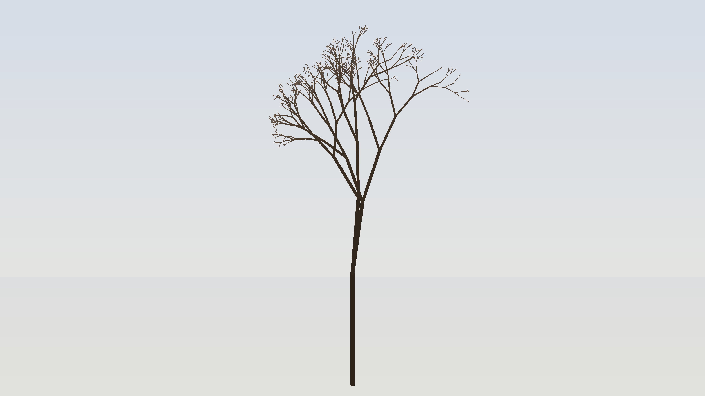

# L-System Tree

A stochastic fractal tree grown by 11 levels of recursive branching. Each fork introduces random angle jitter and variable length ratios, producing a unique organic canopy on every run. Branch color transitions from dark sienna at the trunk to luminous sage-gold at the tips, set against a deep indigo gradient sky.
