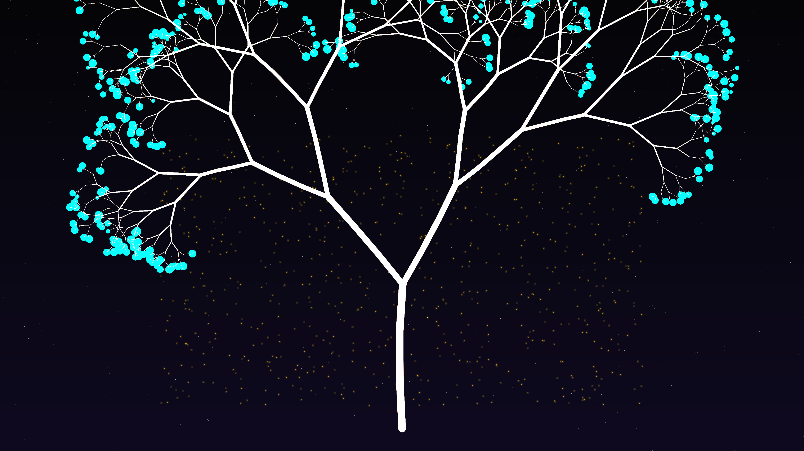

# lsystem_tree_v2

## Metadata
- **Date**: 2026-05-10
- **Theme**: bioluminescent nature, L-system fidelity, fractal growth, beautiful night sky
- **Technique**: stochastic L-system with curved segment subdivision, bioluminescent leaf clustering (ADD blend mode), vectorized sky gradient with integrated starfield
- **Parent Work**: [lsystem_tree](../lsystem_tree/)

## Concept
A high-precision refinement of the `lsystem_tree` concept, addressing the need for more "natural phenomena" in organic simulations. The rigid, mathematical branching is evolved into a more organic, curved structure with bioluminescent teal leaves that pulse against a deep indigo night sky, bridging the gap between algorithmic growth and natural wonder.

## Technical Details
- **Renderer**: P2D
- **Simulation**: stochastic L-system with curved segment subdivision
- **Visuals**: glowing teal leaves (ADD blending), charcoal-to-wood branch gradients, integrated firefly accents, and a dense multi-magnitude starfield.
- **Changes from v1**: Replaced straight segments with curved paths, added bioluminescent leaves and fireflies, updated background to "Beautiful Night Sky" aesthetic.
