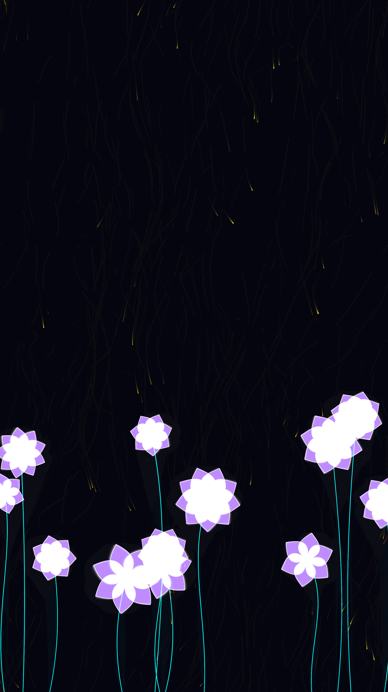

# luminescent_bloom

A generative visualization of exotic bioluminescent flora flowering in a deep-space garden.

## Concept

This artwork explores the intersection of botany and the cosmic void. It imagines a form of life that thrives in the darkness of deep space, using bioluminescence to attract "pollen" and signal its presence. The work focuses on the grace of organic growth and the tranquil rhythm of swaying life-forms in a frictionless, silent environment.

## Technique

- **Recursive-Style Growth**: Plants grow over time using a simple growth factor, unfurling their blooms once a certain height threshold is reached.
- **Swaying Stems**: Stems are rendered as quadratic Bezier curves, with their control points driven by low-frequency noise to simulate a gentle cosmic wind.
- **Ethereal Petals**: Blooms are composed of multiple layers of semi-transparent petals, generated using polar-coordinate symmetry and bezier-curve boundaries.
- **Pulsating Glow**: The cores of the flowers and the edges of the petals pulse with a sinusoidal rhythm, simulating the "breathing" or heartbeat of the flora.
- **Particle System**: Golden "pollen" particles drift through the scene, influenced by the same noise field as the stems, creating a cohesive atmospheric effect.

## Data

- **Date**: 2026-05-02
- **Theme**: Nature, Botanical, Space, Magic
- **Technique**: Bezier curves, Polar symmetry, Particle system, Additive blending
- **Format**: 10s Animation @ 60fps (MP4)
