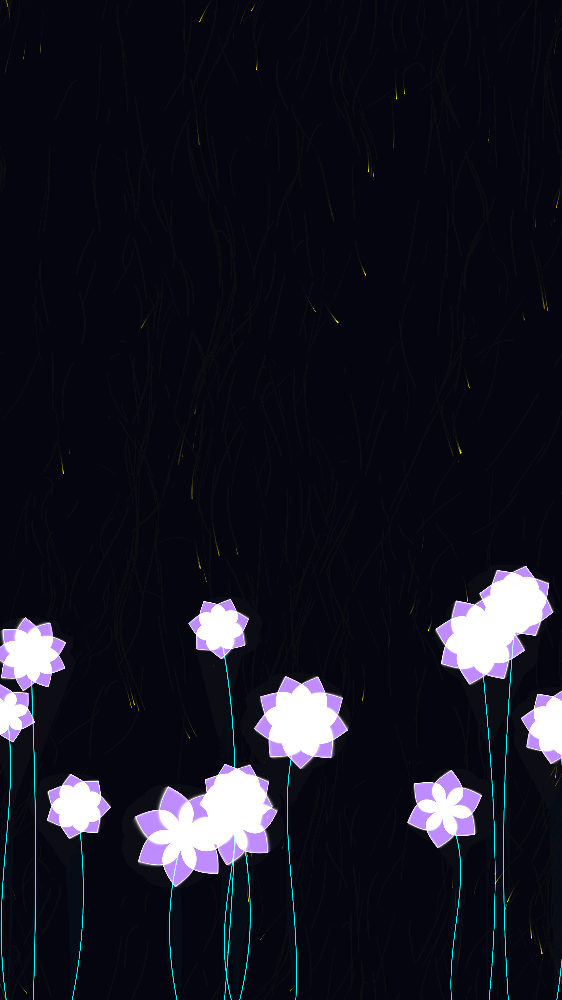

# luminescent_bloom

## Metadata
- **Date**: 2026-05-02
- **Theme**: nature, botanical, space, magic.
- **Technique**: Bezier curves, polar symmetry, particle system, additive blending.
- **Logic Lab Reference**: None

## Concept
Exotic bioluminescent flowers swaying in a deep-space garden, unfurling glowing violet petals as golden pollen drifts through the void.

## Technical Details
- **Renderer**: P2D
- **Simulation**: particle.
- **Visuals**: additive blending.
- **Animation**: 10 seconds at 60fps
