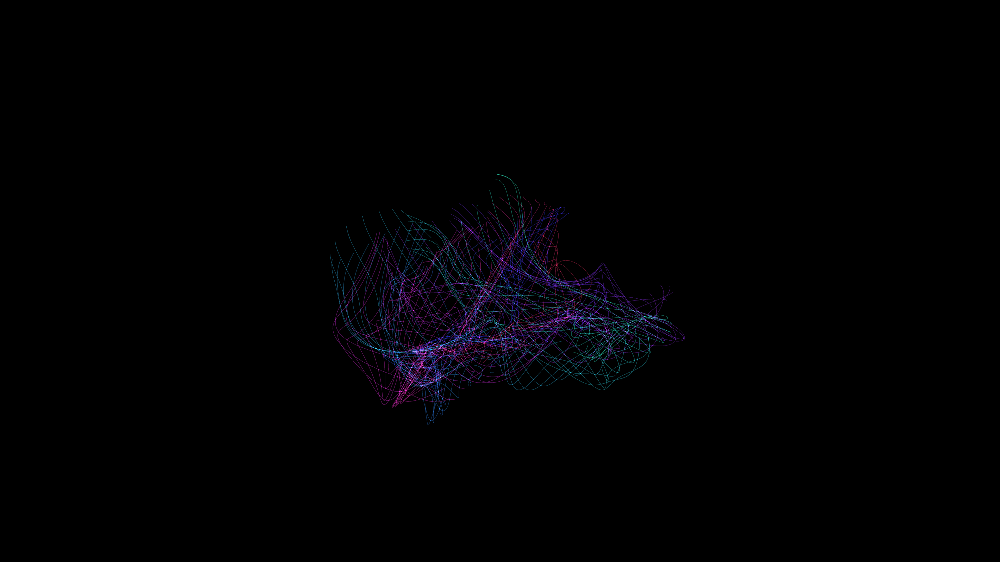

# luminescent_silk_interference_3d

## Metadata
- **Date**: 2026-05-31
- **Theme**: Floating ribbons of bioluminescent silk that intersect and create interference patterns, drifting in
- **Technique**: 3D bezier ribbons whose control points are driven by low-frequency 3D Perlin noise and sine waves. Additive blending where the ribbons overlap.
- **Logic Lab Reference**: 

## Concept
Floating ribbons of bioluminescent silk that intersect and create interference patterns, drifting in a slow current.

## Technical Details
- **Renderer**: Unknown
- **Simulation**: Unknown
- **Visuals**: Unknown
- **Animation**: Unknown
