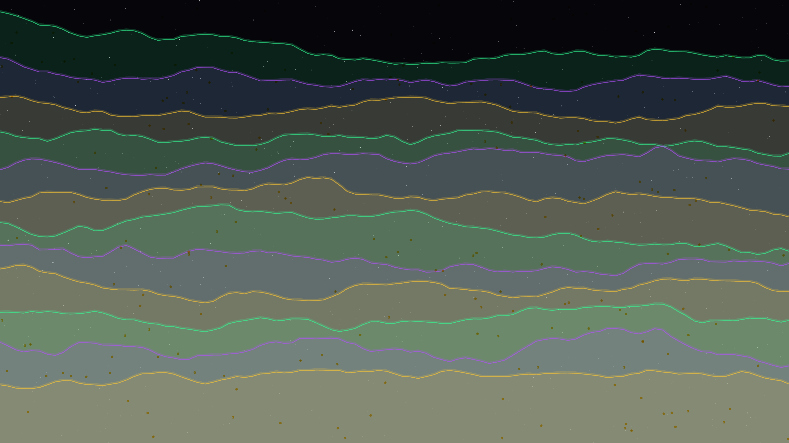

# luminous_strata

## Metadata
- **Date**: 2026-05-05
- **Theme**: Geological history, layered resonance, mineral light, beautiful night sky
- **Technique**: Stacked noise-driven ridges (P2D), spectral edge highlighting, mineral texture mapping (Simplex noise), high-density starfield rendering

## Concept
A shimmering visualization of geological strata where 12 noise-driven layers stack to create a rich, mineral-like landscape; the glowing ridges in emerald, amethyst, and molten gold pulse with a rhythmic planetary resonance against a deep star-dusted midnight void.

## Technical Details
- **Renderer**: P2D
- **Simulation**: Stacked noise-driven ridges (P2D)
- **Visuals**: spectral edge highlighting, mineral texture mapping (Simplex noise), high-density starfield rendering
- **Animation**: 10s @ 60fps (typical)
