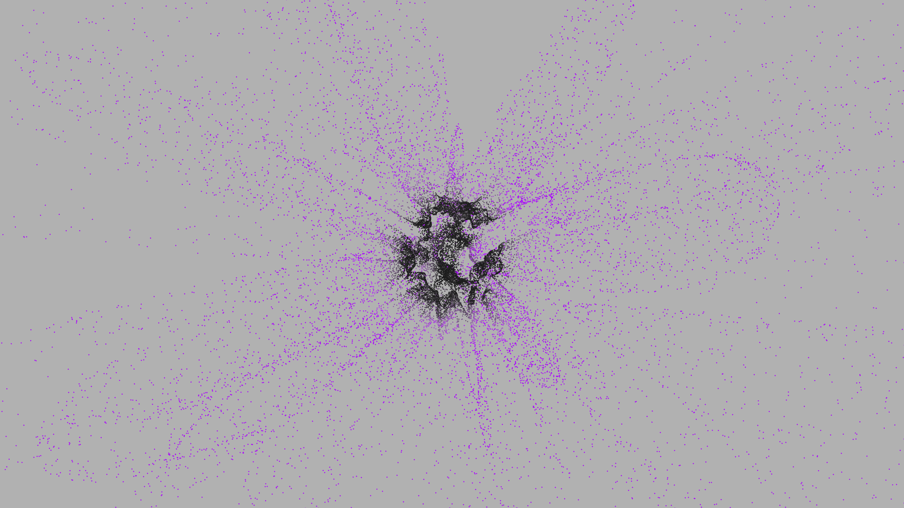

# magnetic_ferrofluid_spikes_3d

## Metadata
- **Date**: 2026-05-29
- **Theme**: - **Date**: 2026-05-29 - **Theme**: A dense cluster of liquid magnetic ferrofluid that rapidly forms
- **Technique**: Unknown
- **Logic Lab Reference**: 

## Concept
- **Date**: 2026-05-29
- **Theme**: A dense cluster of liquid magnetic ferrofluid that rapidly forms sharp geometric spikes and smooth liquid bridges under shifting, invisible magnetic fields.
- **Technique**: A 3D simulation using a dynamic triangulated mesh wrapped around a sphere. The vertices are displaced outwards based on 3D Perlin noise parameterized to simulate sharp spikes that undulate and merge.
- **Description**: An animated glossy, spiky metallic structure writhing against a bright void.

## Technical Details
- **Renderer**: Unknown
- **Simulation**: Unknown
- **Visuals**: Unknown
- **Animation**: Unknown
