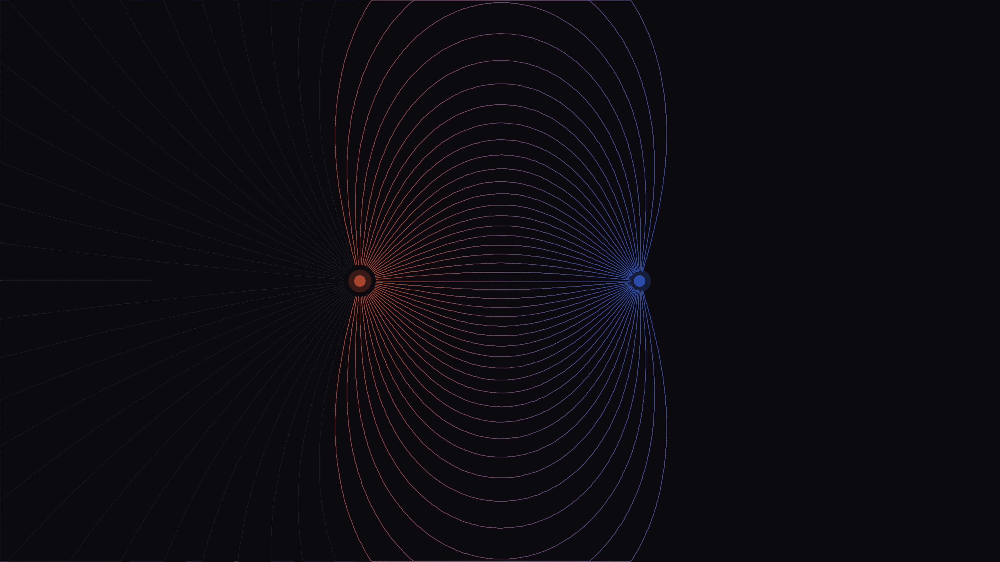

# magnetic_field

## Metadata
- **Date**: 2026-04-26
- **Theme**: physics, electromagnetism, invisible forces, streamlines.
- **Technique**: Euler streamline integration of analytic dipole field, color-encoded pole polarity.
- **Logic Lab Reference**: None

## Concept
72 field lines seeded at uniform angles from the N pole and integrated through a two-pole dipole field; N→S connecting lines rendered with warm-red→cold-blue gradient; escaping lines appear as dim peripheral arcs.

## Technical Details
- **Renderer**: P2D
- **Simulation**: Euler streamline integration of analytic dipole field, color-encoded pole polarity.
- **Visuals**: bloom-like highlights, dark-field contrast.
- **Animation**: Still image
