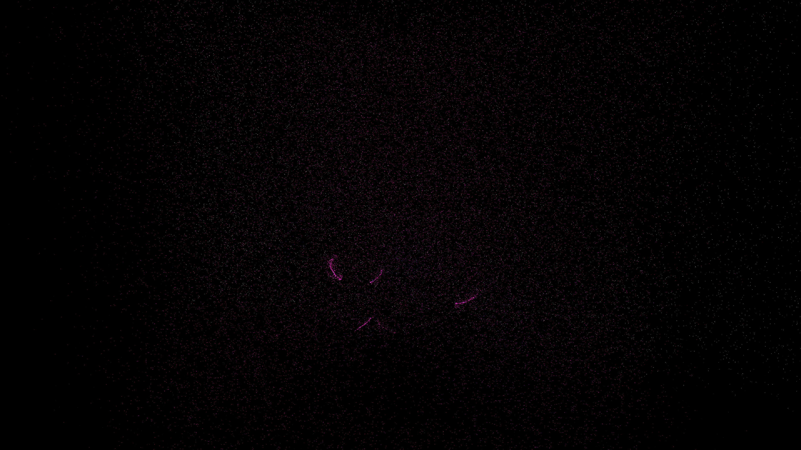

# magnetic_filament_weave

## Metadata
- **Date**: 2026-05-07
- **Theme**: Galactic magnetic fields, interstellar filaments, cosmic magnetism, beautiful night sky.
- **Technique**: 3D magnetic field simulation using a combined toroidal spiral field and 5 localized rotating dipoles (NumPy). 150,000 particles are advected along the field lines, leaving persistent silken trails that create a dense, braided texture. Features multi-pass additive rendering with a "Cosmic Neon" HSB palette (Cyan/Magenta/Gold) and a high-density starfield (12,000 stars). 60fps high-bitrate MP4.
- **Logic Lab Reference**: None

## Concept
A majestic visualization of the galaxy's magnetic architecture; thousands of silken, glowing filaments trace the invisible field lines that braid and twist through the interstellar void, acting as a cosmic loom for stardust against a silent, star-dusted night.

## Technical Details
- **Renderer**: P3D
- **Simulation**: NumPy, particle.
- **Visuals**: additive blending, HSB spectral mapping, persistent trails, bloom-like highlights, prismatic color, dark-field contrast.
- **Animation**: 10 seconds at 60fps
