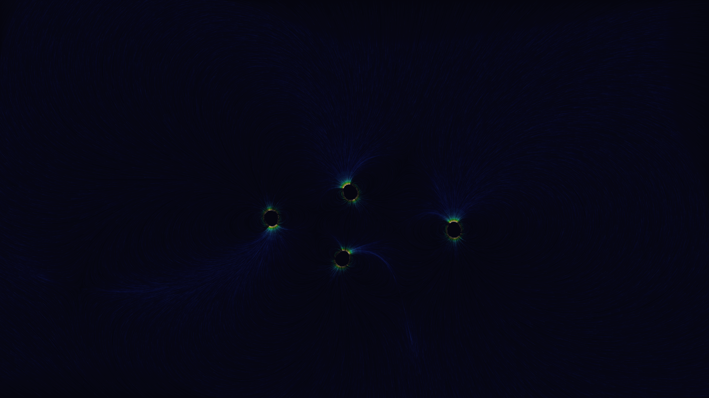

# magnetic_reconnection

## Metadata
- **Date**: 2026-05-05
- **Theme**: Solar physics, plasma energy, magnetic snap, beautiful night sky.
- **Technique**: Vectorized 50,000-particle advection, dynamic multi-pole magnetic field reconnection, kinetic energy spectral mapping, high-density starfield rendering.
- **Logic Lab Reference**: None

## Concept
An intricate visualization of solar magnetic physics where 50,000 silken filaments trace the invisible architecture of a multi-pole magnetic field; periodic "reconnection" events send shimmering shockwaves of molten gold and stark white light through the deep star-dusted indigo void.

## Technical Details
- **Renderer**: P2D
- **Simulation**: particle.
- **Visuals**: HSB spectral mapping, prismatic color, dark-field contrast.
- **Animation**: 10 seconds at 60fps
