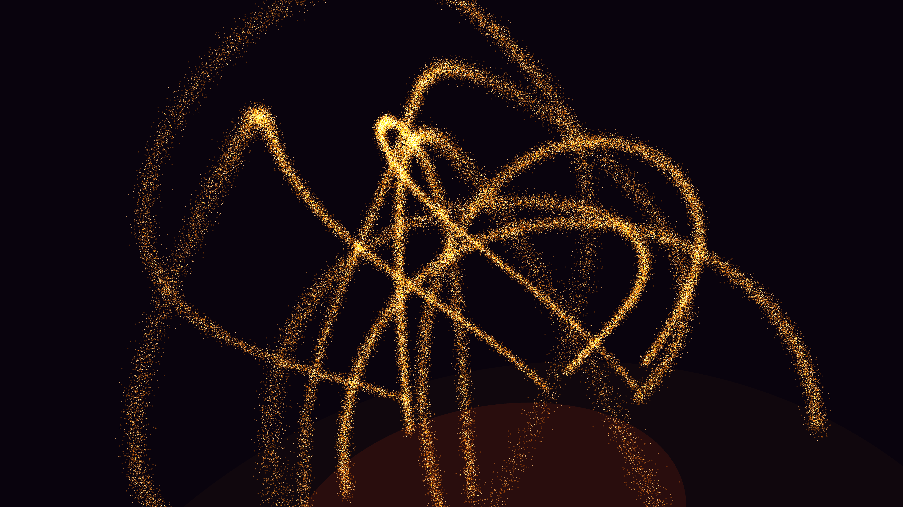

# magnetic_reconnection_flare

## Metadata
- **Date**: 2026-05-10
- **Theme**: Solar plasma, magnetic field topology, magnetic reconnection, astrophysics, coronal loops.
- **Technique**: 3D simulation of plasma particles bound to twisting, dynamic magnetic field lines (parameterized curves). As the loops twist and intersect, a "reconnection event" occurs, releasing a burst of high-energy particles. The simulation uses 80,000 particles moving along structured paths, with explosive radial bursts during reconnection. Intense additive blending with a bloom effect.
- **Logic Lab Reference**: None

## Concept
Giant, glowing arching loops of fiery orange and violet plasma twist in the dark. As the loops pinch together, a blinding white explosion of energy bursts outwards, scattering high-speed particles across the void.

## Technical Details
- **Renderer**: P3D
- **Simulation**: particle.
- **Visuals**: additive blending, bloom-like highlights, dark-field contrast.
- **Animation**: 15 seconds at 60fps
