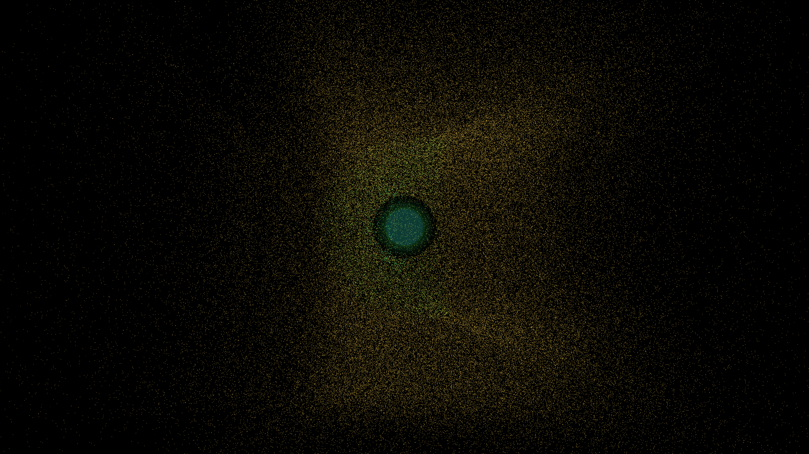

# magnetic_storm

## Metadata
- **Date**: 2026-05-06
- **Theme**: Magnetosphere, solar wind, bow shock, auroral energy, beautiful night sky.
- **Technique**: Vectorized 3D particle advection (150,000 particles) along a combined magnetic dipole field and constant solar wind flux. Particles are continuously emitted from a solar source and deflected by a parabolic magnetic shield. Features a shimmering bow shock, trapped auroral filaments, and a long magnetotail. Multi-pass rendering for the planet and its atmospheric glow. 60fps high-bitrate MP4 encoding.
- **Logic Lab Reference**: None

## Concept
A majestic visualization of a planet's invisible shield; a constant stream of molten white-gold particles from the sun is deflected into a beautiful, glowing shell of electric emerald and cyan energy, trailing off into the deep indigo void as a shimmering magnetotail.

## Technical Details
- **Renderer**: P3D
- **Simulation**: particle, 3D particle.
- **Visuals**: bloom-like highlights, dark-field contrast.
- **Animation**: 10 seconds at 60fps
