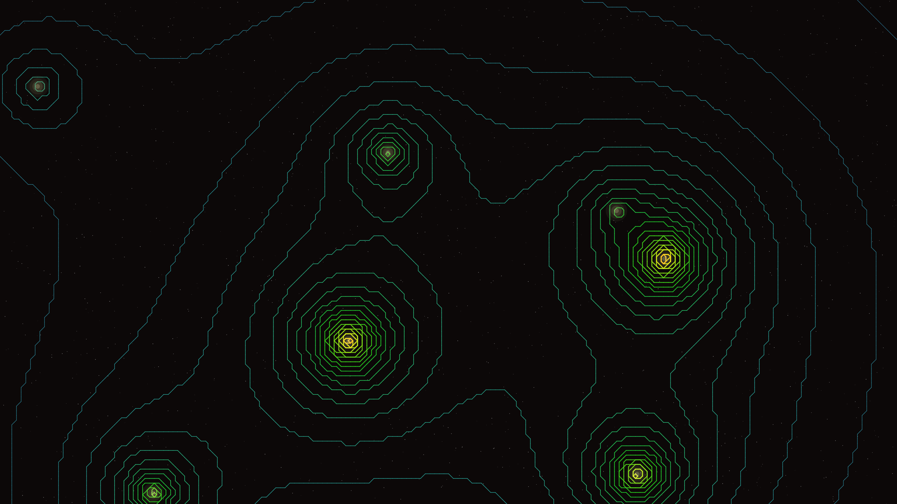

# magnetic_topography

## Metadata
- **Date**: 2026-05-04
- **Theme**: Hidden magnetic fields, topographical abstraction, energy maps, beautiful night sky
- **Technique**: Magnetic dipole field synthesis, Marching Squares contour extraction, HSB spectral mapping, atmospheric starfield rendering

## Concept
A dense, shimmering topographical map of magnetic energy where hundreds of flowing lines swirl and converge around invisible dipoles; the colors transition from deep teal to molten copper against a silent, star-dusted charcoal void.

## Technical Details
- **Renderer**: P2D
- **Simulation**: Magnetic dipole field synthesis
- **Visuals**: Marching Squares contour extraction, HSB spectral mapping, atmospheric starfield rendering
