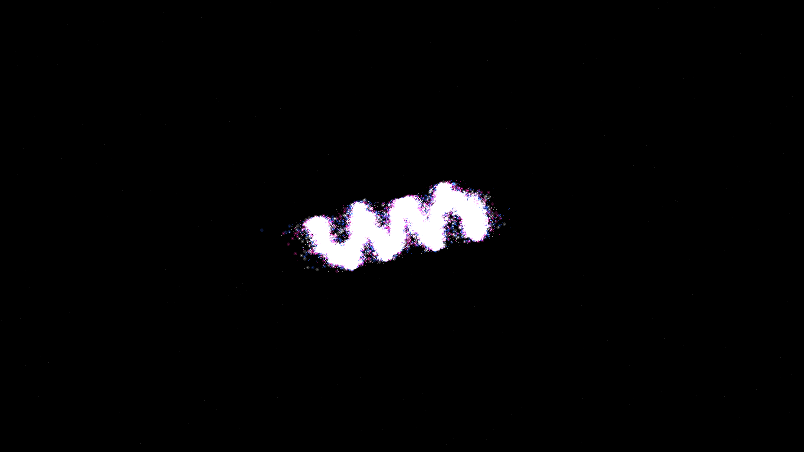

# magnetohydrodynamic_z_pinch_instability

## Metadata
- **Date**: 2026-05-11
- **Theme**: Fusion energy, plasma physics, Z-pinch confinement, sausage and kink instabilities, magnetohydrodynamics (MHD).
- **Technique**: 3D magnetic field simulation of a central current column. Implements harmonic deformations corresponding to sausage (radial) and kink (helical) instability modes. 100,000 tracers. 10s 4K/60fps MP4.
- **Logic Lab Reference**: None

## Concept
A vertical column of intense light starts in a stable cylindrical configuration but quickly succumbs to the violent forces of electromagnetism, deforming into chaotic kinks and sausages.

## Technical Details
- **Renderer**: P2D
- **Simulation**: 3D magnetic field simulation of a central current column.
- **Visuals**: bloom-like highlights, dark-field contrast.
- **Animation**: 10 seconds at 60fps
