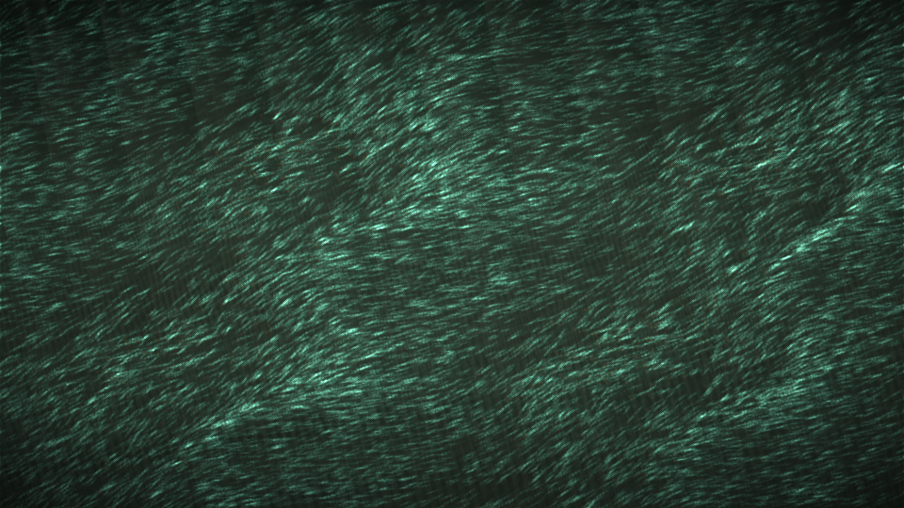

# magnetotactic_compass_swarm

## Metadata
- **Date**: 2026-05-13
- **Theme**: Magnetotactic bacteria quietly reorienting as an invisible magnetic field turns through a microscope slide.
- **Technique**: Vectorized 2D bacterial swarm simulation with rotating-field alignment, local oxygen-driven wobble, rod-shaped density deposition, magnetite core darkening, field-line memory, and persistent trails rendered directly through the py5 pixel buffer. 10s 4K/60fps MP4.
- **Logic Lab Reference**: None

## Concept
Thousands of teal microbial rods drift over an olive-black slide, then slowly swing into a shared direction as faint pearl field lines pass through them; amber tips and dark magnetite cores make the swarm feel alive, precise, and quietly compelled.

## Technical Details
- **Renderer**: P2D
- **Simulation**: Vectorized 2D bacterial swarm simulation with rotating-field alignment, local oxygen-driven wobble, rod-shaped density deposition, magnetite.
- **Visuals**: pixel-buffer rendering, persistent trails, dark-field contrast.
- **Animation**: 10 seconds at 60fps
