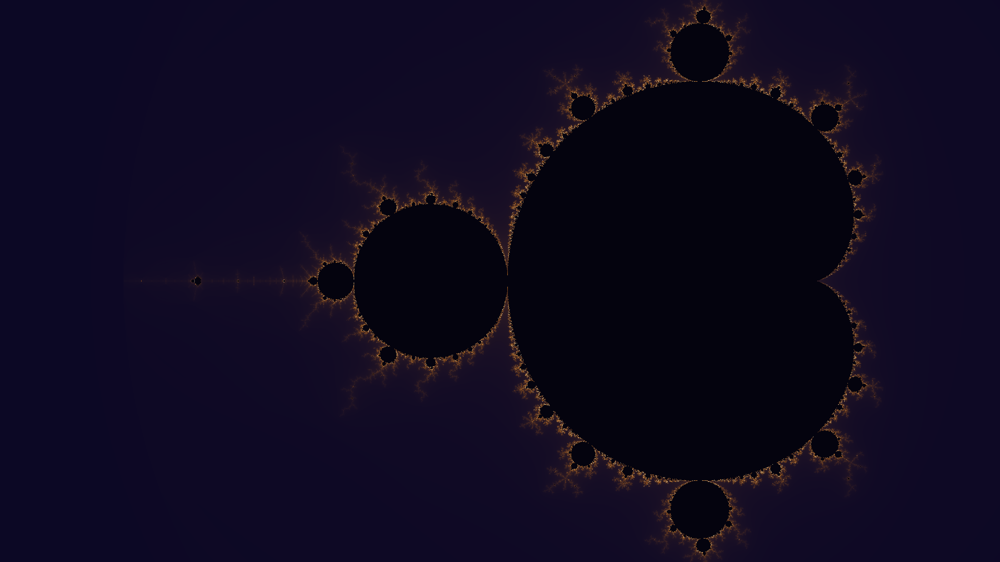

# mandelbrot_set

## Metadata
- **Date**: 2026-04-26
- **Theme**: mathematics, complex dynamics, fractal geometry, parameter space.
- **Technique**: vectorized numpy escape-time iteration, smooth coloring (ν = i+1−log₂(log₂|z|)), 3-stop violet→amber→gold gradient.
- **Logic Lab Reference**: None

## Concept
The Mandelbrot set rendered with smooth escape-time coloring; the fractal boundary glows amber-gold where orbits take longest to escape, cooling to deep violet in the empty exterior; the interior remains near-black.

## Technical Details
- **Renderer**: P2D
- **Simulation**: Vectorized NumPy, NumPy.
- **Visuals**: bloom-like highlights, dark-field contrast.
- **Animation**: Still image
