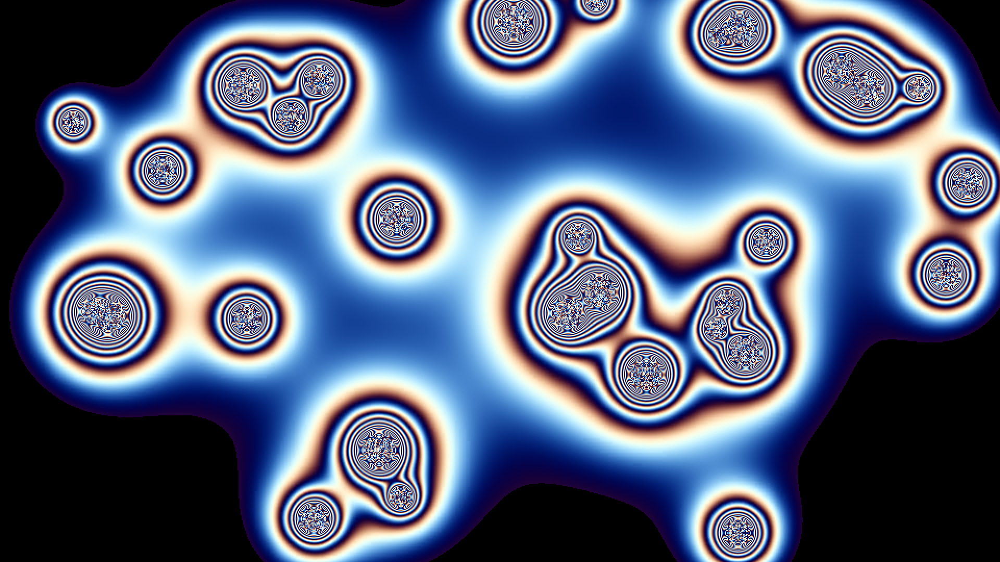

# metaballs_liquid_metal

## Metadata
- **Date**: 2026-05-23
- **Theme**: A mesmerizing simulation of fluid, metallic metaballs merging and dividing
- **Technique**: Unknown
- **Logic Lab Reference**: 

## Concept
A mesmerizing simulation of fluid, metallic metaballs merging and dividing.

- **Date**: 2026-05-23
- **Theme**: Fluid dynamics, implicit surfaces, metallic reflections, retro demoscene.
- **Technique**: We simulate 30 bouncy physics particles and compute a 2D scalar field representing their inverse-square distance functions. Instead of rendering them as solid blobs, we pass the scalar field through phase-shifted periodic sine functions. This creates alternating bands of light and dark that perfectly mimic the environmental reflections of shiny liquid metal (like mercury or chrome). The outer boundary is clamped via a hard threshold mask. Computed completely via vectorized NumPy grid operations and upscaled to full resolution. 15s 60fps MP4.
- **Description**: 30 spheres of liquid mercury fly around a pitch-black canvas. When they get close, they seamlessly snap together and merge into larger, amorphous blobs. The intricate, wavy light bands inside the blobs constantly shift and distort, creating an extremely convincing metallic sheen that reflects an invisible, striped environment.

## Technical Details
- **Renderer**: Unknown
- **Simulation**: Unknown
- **Visuals**: Unknown
- **Animation**: Contains animation details
