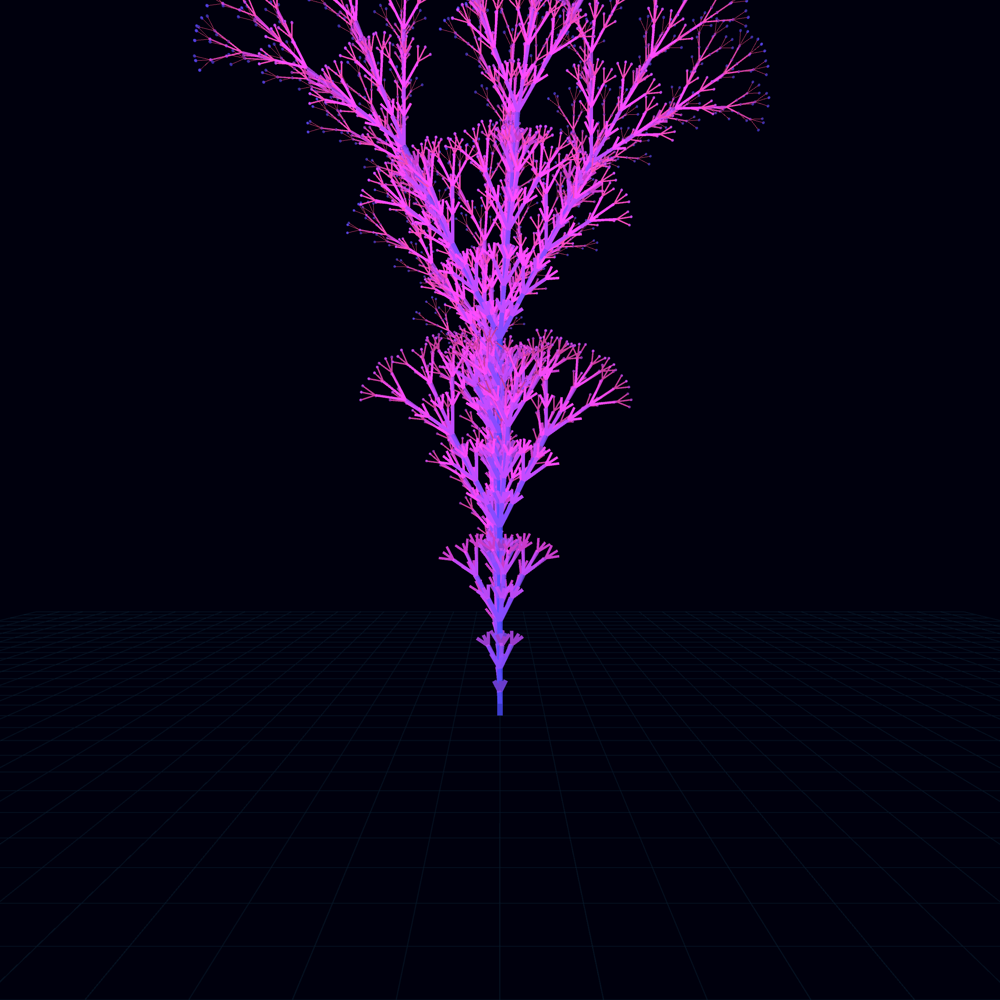

# metabolic_growth

## Metadata
- **Date**: 2026-05-04
- **Theme**: Algorithmic botany, synthetic life, metabolic pulse, modern twist.
- **Technique**: 3D L-System branching, recursive depth modulation, glowing branch gradients, wireframe perspective grid.
- **Logic Lab Reference**: None

## Concept
A complex, glowing 3D organism grows from a dark wireframe grid; violet and cyan branches pulse with a rhythmic algorithmic breath, while terminal nodes flicker with spectral light against a deep star-dusted void.

## Technical Details
- **Renderer**: P3D
- **Simulation**: recursive, L-system.
- **Visuals**: HSB spectral mapping, bloom-like highlights, prismatic color, dark-field contrast.
- **Animation**: Animation
