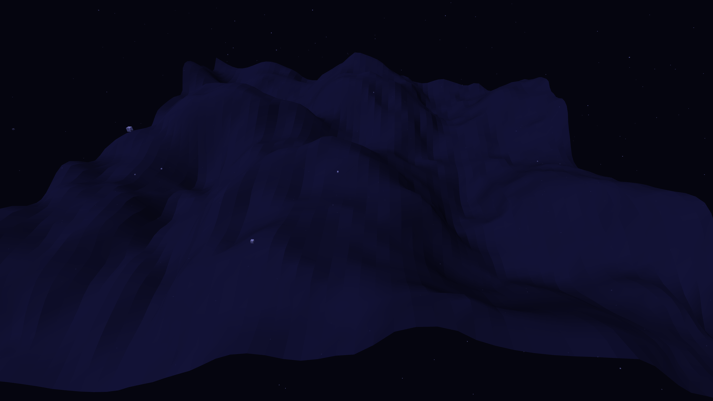

# metabolic_landscape

## Metadata
- **Date**: 2026-05-05
- **Theme**: Living geography, organic terrain, pulsating resonance, beautiful night sky.
- **Technique**: 3D domain-warped mesh (P3D), metabolic contour pulse modulation, dynamic camera rotation, high-density starfield rendering.
- **Logic Lab Reference**: None

## Concept
A vast, dark planetary landscape generated by second-order domain warping that appears to breathe; shimmering neon emerald and electric amethyst contours pulse across organic ridges and valleys against a star-dusted midnight sky.

## Technical Details
- **Renderer**: P3D
- **Simulation**: 3D domain-warped mesh (P3D), metabolic contour pulse modulation, dynamic camera rotation, high-density starfield rendering.
- **Visuals**: bloom-like highlights, dark-field contrast.
- **Animation**: 10 seconds at 60fps
