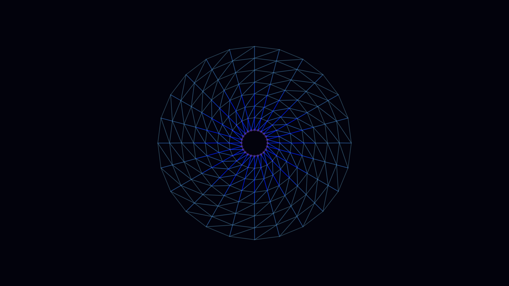

# metabolic_lattice

## Metadata
- **Date**: 2026-05-04
- **Theme**: Kinetic tension, metabolic elasticity, structural vibration, iridescent membranes.
- **Technique**: Verlet integration, radial spring mesh, stress-based HSB mapping, atmospheric bloom rendering.
- **Logic Lab Reference**: None

## Concept
A living, breathing radial lattice of glowing conduits that ripples and shudders under a central metabolic pulse; stress-induced colors shift from deep violet to electric cyan as the structure maintains its precarious equilibrium.

## Technical Details
- **Renderer**: P2D
- **Simulation**: Verlet.
- **Visuals**: HSB spectral mapping, bloom-like highlights, dark-field contrast.
- **Animation**: 10 seconds at 60fps
