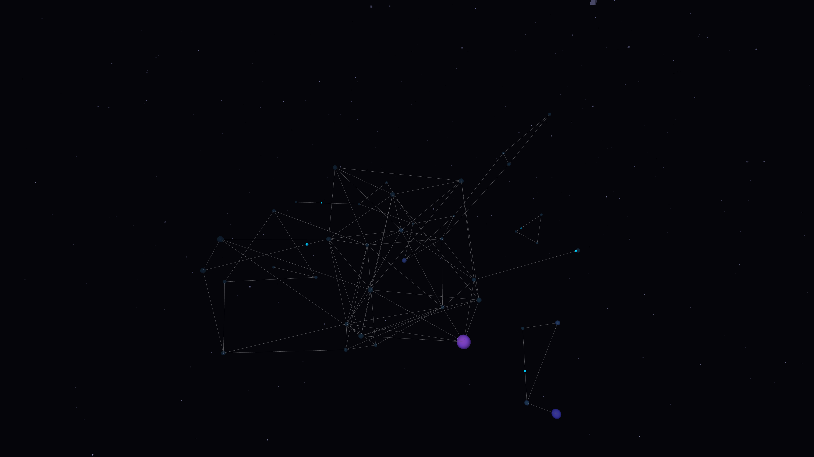

# metabolic_nodes

## Metadata
- **Date**: 2026-05-05
- **Theme**: Living networks, organic computation, synthetic synapse, beautiful night sky.
- **Technique**: 3D stochastic network construction (P3D), luminous pulse propagation, dynamic node resonance, high-density starfield rendering.
- **Logic Lab Reference**: None

## Concept
An intricate visualization of a living digital network that pulses and breathes in a deep void; glowing cyber lime and royal amethyst pulses travel through dense architectural synapses against a star-dusted midnight sky.

## Technical Details
- **Renderer**: P3D
- **Simulation**: 3D stochastic network construction (P3D), luminous pulse propagation, dynamic node resonance, high-density starfield rendering.
- **Visuals**: bloom-like highlights, dark-field contrast.
- **Animation**: 10 seconds at 60fps
