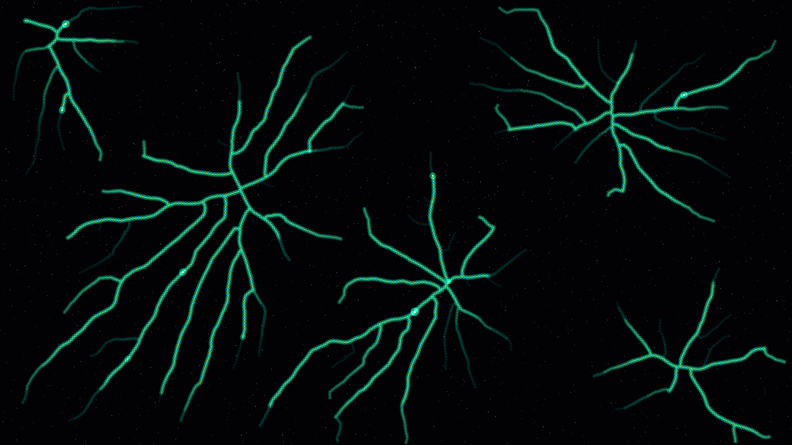

# metabolic_rhizome

## Metadata
- **Date**: 2026-05-05
- **Theme**: Organic growth, cosmic connectivity, rhizomatic systems, beautiful night sky.
- **Technique**: Space-colonization algorithm (nutrient-driven growth), multi-root initialization, adaptive path thickness (flow-based scaling), bioluminescent teal/violet shading, additive junction highlights.
- **Logic Lab Reference**: None

## Concept
A delicate, glowing web of energy that branches and weaves through a deep star-dusted void; using a space-colonization algorithm, the network self-organizes into an optimized transport system that pulses with bio-phosphor teal and neural violet, revealing the organic, interconnected nature of the cosmic vacuum.

## Technical Details
- **Renderer**: P2D
- **Simulation**: Space-colonization algorithm (nutrient-driven growth), multi-root initialization, adaptive path thickness (flow-based scaling), bioluminesce.
- **Visuals**: additive blending.
- **Animation**: Still image
