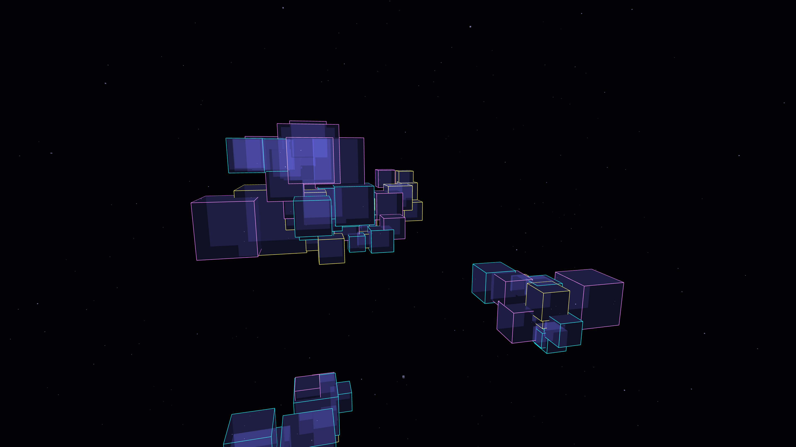

# metabolic_voxels

## Metadata
- **Date**: 2026-05-05
- **Theme**: Living architecture, geometric metabolism, digital growth, beautiful night sky.
- **Technique**: 3D recursive growth (P3D), spectral edge highlighting, animated "breathing" scale, dynamic camera rotation, high-density starfield.
- **Logic Lab Reference**: None

## Concept
A vast, dark space filled with massive, glowing 3D monoliths that grow and breathe like synthetic corals; the recursive structures in slate and graphite pulse with electric cyan and amethyst highlights against a star-dusted midnight void.

## Technical Details
- **Renderer**: P3D
- **Simulation**: recursive.
- **Visuals**: HSB spectral mapping, prismatic color.
- **Animation**: 10 seconds at 60fps
