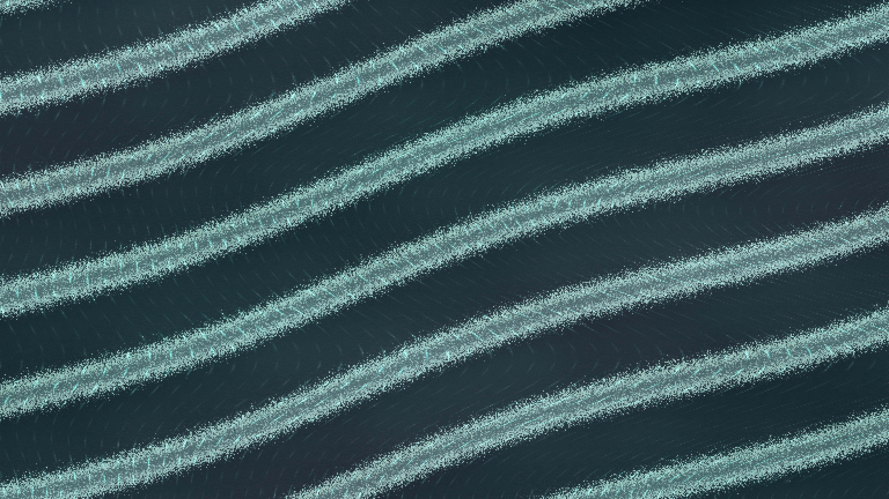

# metachronal_cilia_field

## Metadata
- **Date**: 2026-05-10
- **Theme**: microscopic cilia moving in coordinated metachronal waves across a dim biological membrane.
- **Technique**: Procedural 2D phase-field animation of cilia beat timing and recovery. Vectorized comb-ridge synthesis creates thousands of short filament strokes without per-stroke drawing; local shear accumulates into a fading flow-memory buffer, with cyan/pearl metachronal bands and subtle coral afterimages rendered directly through the py5 pixel buffer. 10s 4K/60fps MP4, generated as `output.mp4` and mirrored to `metachronal_cilia_field.mp4`.
- **Logic Lab Reference**: None

## Concept
Diagonal bands of tiny luminous cilia sweep across a dark teal membrane, producing coordinated pearl-and-cyan waves with faint coral traces that read like an organism moving fluid through microscopic rhythm.

## Technical Details
- **Renderer**: P2D
- **Simulation**: Procedural 2D phase-field animation of cilia beat timing and recovery.
- **Visuals**: pixel-buffer rendering, dark-field contrast.
- **Animation**: 10 seconds at 60fps
