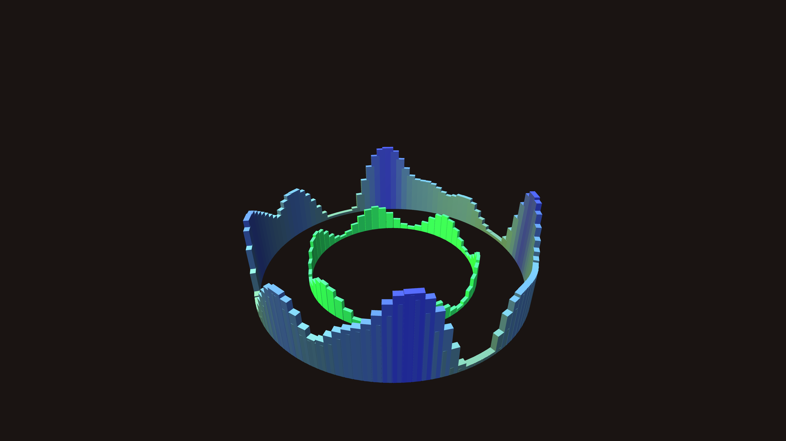

# metallic_monolith_ripple_ring_3d

A massive ring of floating metallic monolithic pillars that ripple and change height based on a complex mathematical beat, resembling a 3D audio-reactive visualization.

## Technique

Two concentric rings of tall 3D boxes. Their Z-heights are driven by overlapping sinusoidal functions and 2D OpenSimplex noise. Dynamic directional and point lighting gives the boxes a metallic sheen, while depth testing ensures proper 3D occlusion. Color shifts based on height to emphasize the rippling wave motion.
