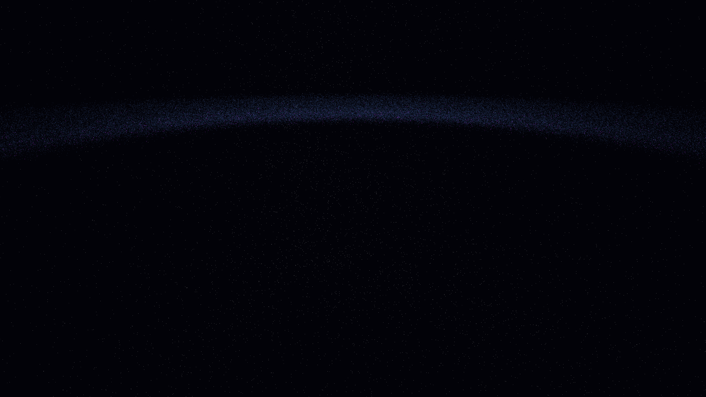

# mhd_accretion_turbulence

## Metadata
- **Date**: 2026-05-09
- **Theme**: MHD turbulence, accretion disks, plasma physics, beautiful night sky.
- **Technique**: 3D simulation of 180,000 particles in a Keplerian disk with magnetic tension proxies and MRI-inspired turbulence. Multi-pass additive rendering with kinetic energy color mapping. "Incandescent Orange / Plasma Blue / Obsidian Black" palette. 60fps high-bitrate MP4.
- **Logic Lab Reference**: None

## Concept
A violent, beautiful visualization of plasma turbulence in a black hole's accretion disk; swirling ropes of orange and blue fire are twisted by invisible magnetic fields, creating a rhythmic, incandescent dance of matter at the edge of the void.

## Technical Details
- **Renderer**: P3D
- **Simulation**: particle.
- **Visuals**: additive blending, dark-field contrast.
- **Animation**: 10 seconds at 60fps
