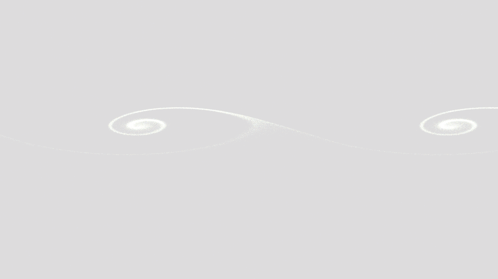

# mhd_kelvin_helmholtz_waves

## Metadata
- **Date**: 2026-05-10
- **Theme**: plasma dynamics, magnetohydrodynamics, fluid billows, beautiful night sky.
- **Technique**: Vectorized 2D/3D particle advection (NumPy). Implements a magnetized shear layer simulation with a magnetic tension proxy resisting vertical displacement ($v_y \leftarrow v_y - \beta y$). Features a 60,000-particle system with persistence-based motion blur and additive blending in P2D.
- **Logic Lab Reference**: None

## Concept
A majestic visualization of the Kelvin-Helmholtz instability in a magnetized cosmic fluid. Luminous filaments of teal and gold roll and billow into intricate spirals against a deep amethyst void, captured as they trace the invisible magnetic lines that attempt to bind them.

## Technical Details
- **Renderer**: P2D
- **Simulation**: NumPy, particle, 3D particle.
- **Visuals**: additive blending, bloom-like highlights.
- **Animation**: 15 seconds at 60fps
