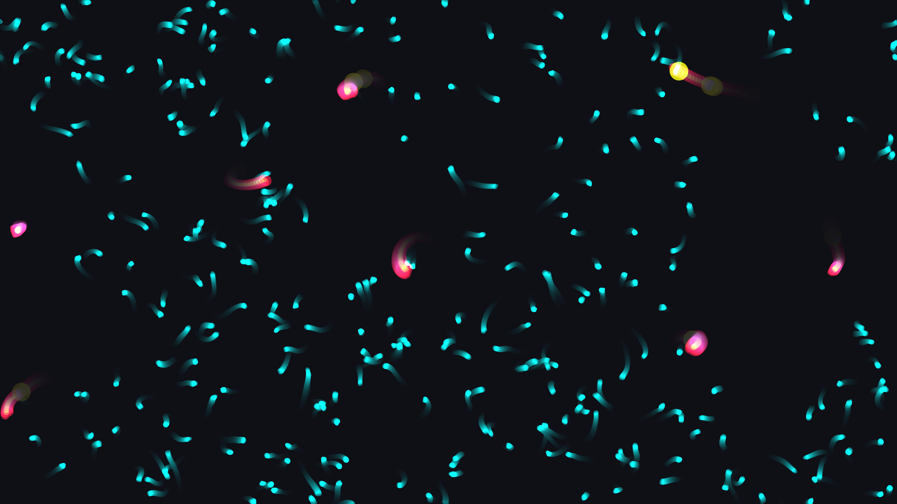

# microscopic_amoeba_predator_prey_2d

## Metadata
- **Date**: 2026-06-14
- **Theme**: An animated 20s sequence of a high-density microscopic ecosystem with a fluid dark background
- **Technique**: 2D agent-based simulation. The predators use an attraction force towards nearby prey. Movement paths are disturbed by a global Perlin noise flowfield simulating a liquid slide. Additive blending with organic curves for the cells, drawn using `py5.curve_vertex` with dynamic noise to simulate organic wobble.
- **Logic Lab Reference**: 

## Concept
An animated 20s sequence of a high-density microscopic ecosystem with a fluid dark background.

## Technical Details
- **Renderer**: Unknown
- **Simulation**: Unknown
- **Visuals**: Unknown
- **Animation**: Unknown
