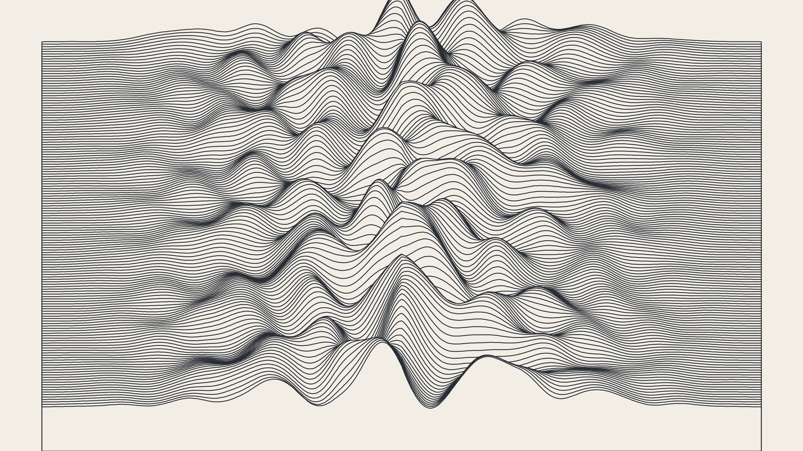

# minimalist_zen_sand_garden_topography_2d

## Metadata
- **Date**: 2026-06-15
- **Theme**: An animated 15s sequence of minimalist generative topography lines slowly shifting, reminiscent of a
- **Technique**: 150 horizontal lines are drawn, consisting of 300 points each. The y-coordinate of each point is offset using `py5.os_noise`, creating a topographic map effect similar to Joy Division's Unknown Pleasures. The noise shifts over time, animating the peaks and valleys. The edges are smoothly tapered, and lines are filled below to occlude the lines drawn underneath.
- **Logic Lab Reference**: 

## Concept
An animated 15s sequence of minimalist generative topography lines slowly shifting, reminiscent of a zen sand garden or map contour lines.

## Technical Details
- **Renderer**: Unknown
- **Simulation**: Unknown
- **Visuals**: Unknown
- **Animation**: Unknown
