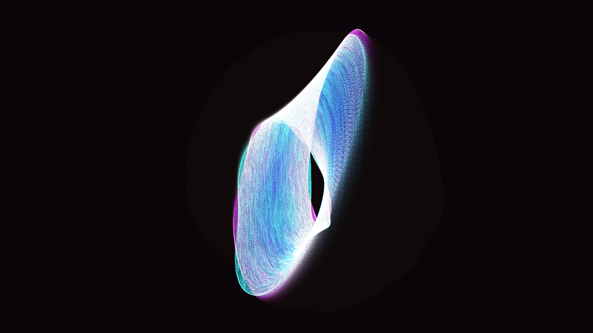

# mobius_geodesic_flow

Non-orientable topology, continuous flow, mathematical beauty.

## Technical Details

- **Type**: Animation (15s @ 60fps)
- **Algorithm**: 3D simulation of 150,000 particles constrained to a parametric Möbius strip. Particles follow a continuous flow field parameterized by $(u, v)$ where $u$ is the angle along the strip and $v$ is the width. Particles wrap around the non-orientable boundary. Projected to 2D manually using a rotating perspective camera.
- **Rendering**: Multi-pass additive rendering using `py5.points` with a "Cyan / Magenta / White-Gold" HSB palette against a dark void, binned by hue for performance optimization.

## Preview

