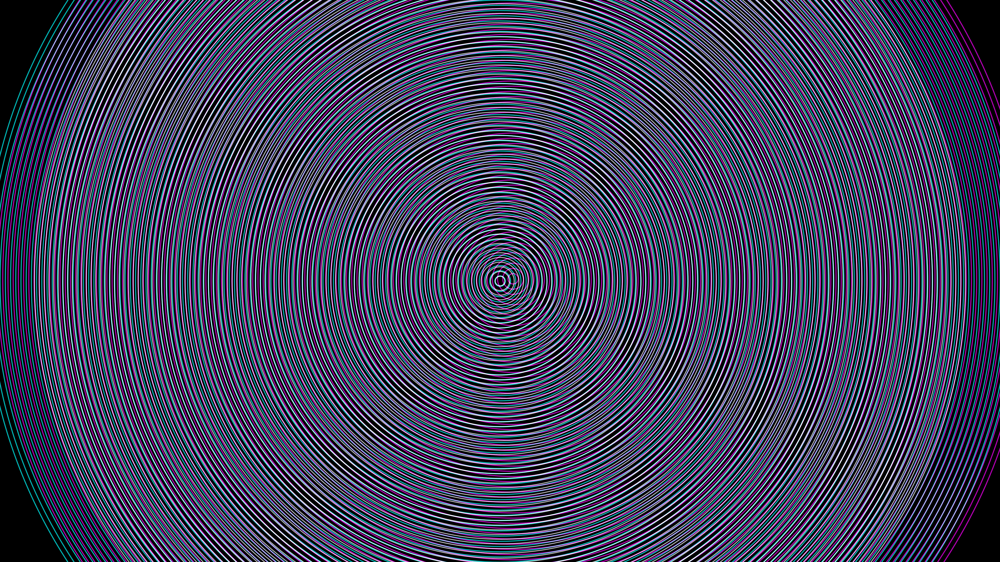

# moire_interference_waves

## Metadata
- **Date**: 2026-05-27
- **Theme**: - **Date**: 2026-05-27 - **Theme**: A hypnotic kinetic art simulation using the Moiré effect
- **Technique**: Unknown
- **Logic Lab Reference**: 

## Concept
- **Date**: 2026-05-27
- **Theme**: A hypnotic kinetic art simulation using the Moiré effect. Overlapping concentric wave patterns that expand and contract, creating dynamic interference patterns.
- **Technique**: Multiple sets of concentric circles or sinusoidal rings are drawn. They slowly rotate, offset, and expand at different frequencies. Additive blending makes the interference fringes pulse with bright light.
- **Description**: An animated Moiré interference pattern.

## Technical Details
- **Renderer**: Unknown
- **Simulation**: Unknown
- **Visuals**: Unknown
- **Animation**: Unknown
