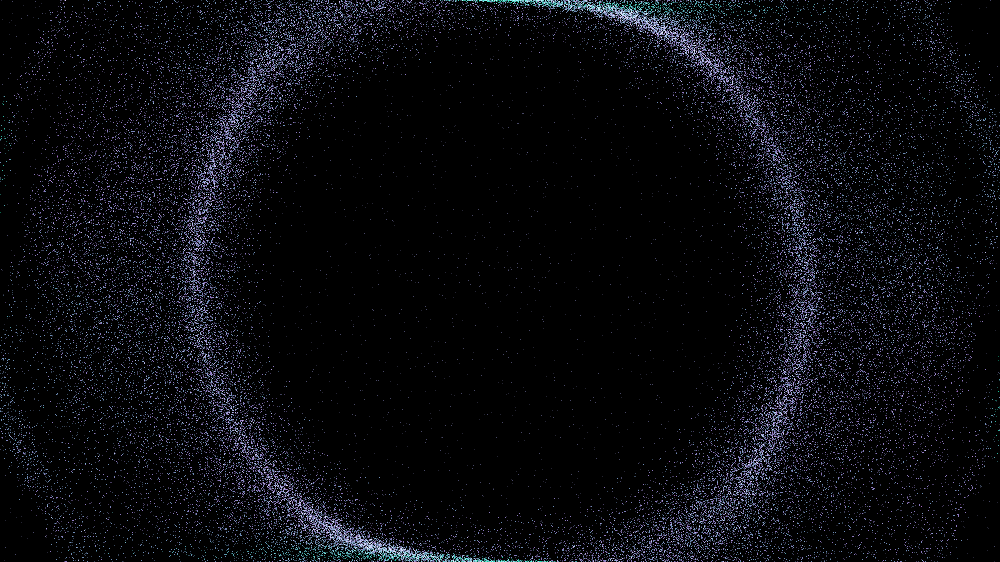

# moire_lattice_resonance

## Metadata
- **Date**: 2026-05-10
- **Theme**: twisted bilayer graphene, Moiré patterns, electron resonance, quantum physics, beautiful night sky.
- **Technique**: 2D particle simulation of 180,000 electron tracers in a dynamic Moiré potential field. Visualizes the interference of two rotating hexagonal lattices. Features multi-pass additive rendering with "Emerald / Cyan / Deep Purple" palette and dynamic twist-angle modulation. 60fps high-bitrate 4K MP4.
- **Logic Lab Reference**: None

## Concept
A stunning visualization of quantum resonance; nearly 200,000 silken particles are guided by the shimmering interference patterns of two twisted atomic lattices, forming complex, rhythmic arcs of cyan and violet light that pulse and breathe against a deep obsidian void.

## Technical Details
- **Renderer**: P2D
- **Simulation**: particle.
- **Visuals**: additive blending, HSB spectral mapping, bloom-like highlights, prismatic color, dark-field contrast.
- **Animation**: Animation
