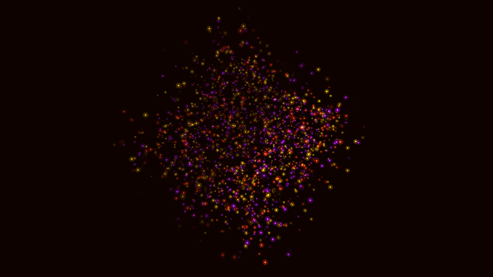

# molten_gold_organic_flowfield_3d

## Details
- **Date**: 2026-06-07
- **Theme**: A swirling, organic fluid simulation resembling liquid gold and nebula dust, moving in 3D space.
- **Technique**: Volumetric particles driven by a 4D Perlin noise flowfield, rendered with additive blending and size scaling.
- **Palette**: Obsidian background, molten gold, crimson red, and deep violet.

## Media

