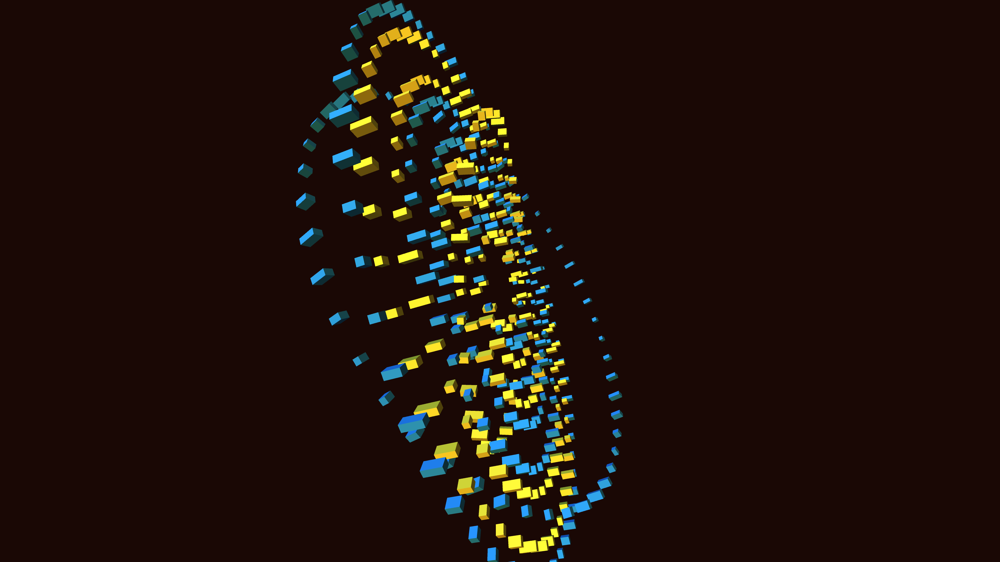

# monolithic_clockwork_mandala_3d

## Metadata
- **Date**: 2026-06-13
- **Theme**: A colossal, intricately nested series of metallic rings and interlocking gears forming a giant 3D cl
- **Technique**: Procedurally generated concentric rings built from dense geometric primitives (boxes). Rings rotate independently on multiple axes with varied speeds. Dynamic lighting highlights the metallic structures against a void, using a cool cyan and glowing gold color palette.
- **Logic Lab Reference**: 

## Concept
A colossal, intricately nested series of metallic rings and interlocking gears forming a giant 3D clockwork mandala in deep space.

## Technical Details
- **Renderer**: Unknown
- **Simulation**: Unknown
- **Visuals**: Unknown
- **Animation**: Animation (20s @ 60fps)
