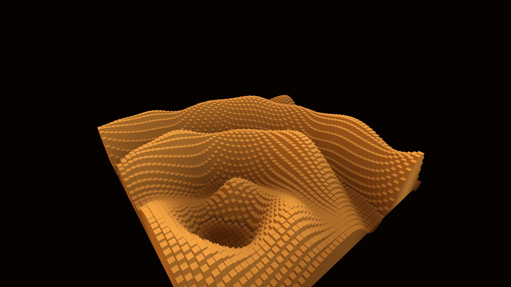

# monolithic_kinetic_wave_interference_lattice_3d

## Metadata
- **Date**: 2026-06-14
- **Theme**: An animated 15s sequence showing a massive city of glowing bronze monolithic pillars that rise and f
- **Technique**: A dense 3D grid of tall boxes. Their height and Y-position are modulated by the summation of multiple sweeping 2D sine wave interference patterns, combined with low-frequency OpenSimplex noise. Dynamic directional lighting creates harsh shadows.
- **Logic Lab Reference**: 

## Concept
An animated 15s sequence showing a massive city of glowing bronze monolithic pillars that rise and fall organically in fluid, intersecting waves.

## Technical Details
- **Renderer**: Unknown
- **Simulation**: Unknown
- **Visuals**: Unknown
- **Animation**: Unknown
