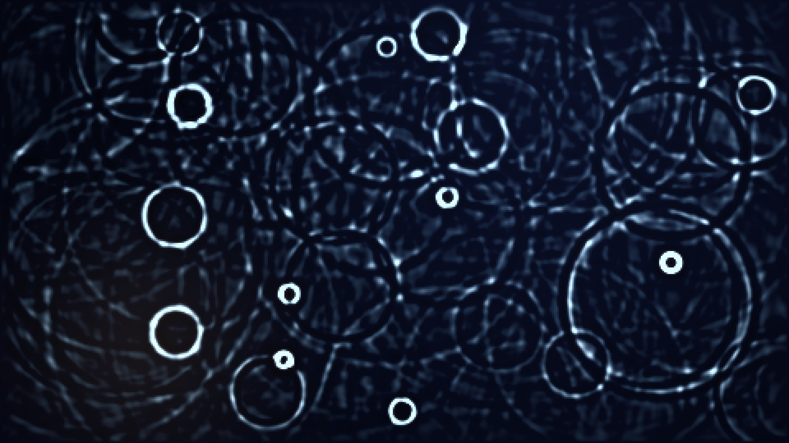

# monsoon_resonance

## Metadata
- **Date**: 2026-05-10
- **Theme**: still pond at midnight, summer monsoon raindrops, wave interference, meditative naturalism.
- **Technique**: 2D scalar wave equation propagated by 5-point FDTD on a 480×270 grid (`u_next = (2u − u_prev + c²·∇²u) · damping`); raindrops injected as Mexican-hat (Laplacian-of-Gaussian) impulses to seed multiple concentric bands; soft border absorber prevents boxy reflections; signed-height shading (positive → cyan/pearl, negative → indigo shadow) plus subtle slope rim. Vectorized NumPy and direct ARGB pixel writes via `py5.np_pixels`. 18s 4K/60fps MP4.
- **Logic Lab Reference**: None

## Concept
A still dark pond surface where occasional silver droplets fall and bloom into expanding rings of moonlight; the rings interfere into a hypnotic shimmer of cyan and pearl bands against deep indigo, with a soft moonlight gradient and a single distant amber lamp at the far shore.

## Technical Details
- **Renderer**: P2D
- **Simulation**: Vectorized NumPy, NumPy.
- **Visuals**: bloom-like highlights, dark-field contrast.
- **Animation**: 18 seconds at 60fps
