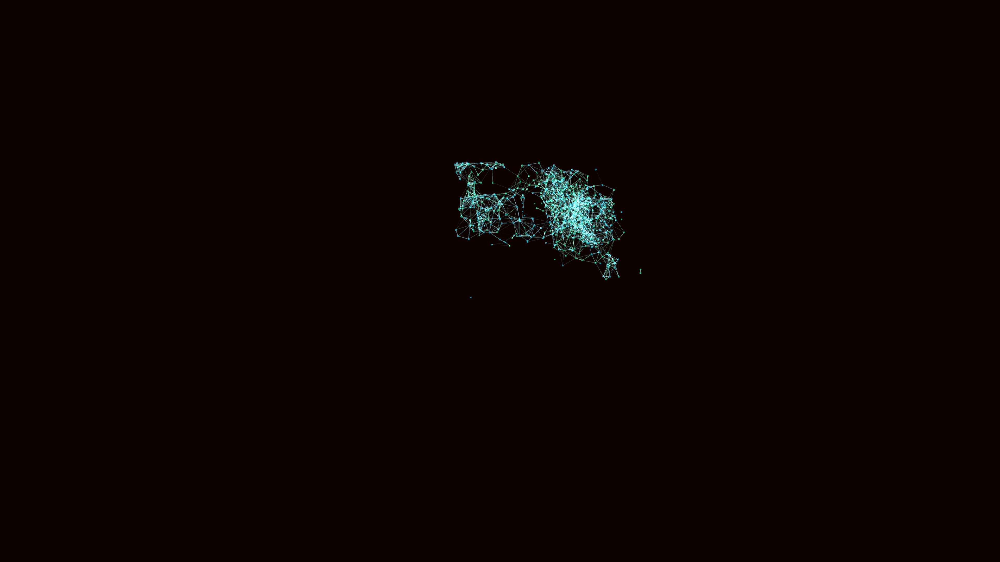

# nanobot_crystalline_assembler_swarm_3d

## Details
- **Date**: 2026-06-07
- **Theme**: A microscopic swarm of crystalline nanobots assembling structures that constantly dissolve into glowing dust.
- **Technique**: Boids-like system with constraints, rendering additive lines and using depth-fading colors to visualize proximity connections.
- **Palette**: Obsidian background, emerald green, and cyan.

## Media

